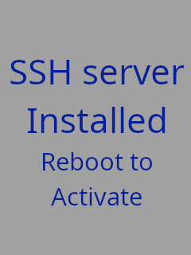

# Install and enable SSH server on Flashforge Adventurer 3

This repo contains a script and files that lets you install and
enable the OpenSSH SSH server on the Flashforge Adventurer 3 3D
printer in a simple way using a USB stick.

## Usage

### Preparation

1. Format a USB stick as FAT32
2. Copy the contents of the `usb_stick` subdirectory to your USB stick.
3. Replace `files/root/.ssh/autorized_keys` on the USB stick with you own public key used to be used for logging in.

### Installation

1. Power off your Adventurer 3.
2. Insert the prepared USB stick into the USB port at the front of your Adventurer 3.
3. Power on the 3D printer. The following will be displayed on the printer touch screen:  

4. Wait until the following is displayed on the touch screen:  

5. Turn of the 3D printer, remove the USB stick and power on again,
6. You should now be able to access the printer via SSH by SSH-ing in as root with the private key which public key was added to authorized_keys.

## Repo contents

### File structure

| Path               | Description                                                                                                                                   |
|--------------------|-----------------------------------------------------------------------------------------------------------------------------------------------|
| `data`             | The start and end screens as PNGs.                                                                                                            |
| `tools/png2ffa3fb` | [png2ffa3fb](https://github.com/vegardw/png2ffa3fb), the tool used to create framebuffer files for display from PNG files as a git submodule. |
| `usb_stick/flashforge_init.sh` | The main installation script, executed by the system when booting with a USB stick inserted.                                      |
| `usb_stick/framebuffer_images` | Framebuffer images for displaying on the touch screen.                                                                            |
| `usb_stick/packages` | OpenWRT `opkg` packages that will be installed. Package installation will be performed first.                                               |
| `usb_stick/files`  | Files that will be copied to the Adventurer 3 file system. File copy will be performed after package installation.                            |
| `usb_stick/scripts` | Scripts that will be run after package installation and file copy.                                                                           |

### opkg packages installed by default

* `openssh-server_7.1p2-1_ramips_24kec.ipk` - OpenSSH server
  * `openssh-keygen_7.1p2-1_ramips_24kec.ipk`, `libopenssl_1.0.2g-1_ramips_24kec.ipk` - Dependencies of `openssh-server`
* `uclient-fetch_2015-04-14-81fdb8fdf1470e1c7bf3124ff20d17feaeb519ee_ramips_24kec.ipk` - Provides `wget`, makes it possible to install
  opkg packages from the internet via `opkg install`
  * `usb_stick/packages/libuclient_2015-04-14-81fdb8fdf1470e1c7bf3124ff20d17feaeb519ee_ramips_24kec.ipk` - Dependency of `uclient-fetch`
* `socat_1.7.3.0-1_ramips_24kec.ipk` - socat, used by for optional serial port forwarding.
* `coreutils-nohup_8.23-1_ramips_24kec.ipk` - nohup, used by for optional serial port forwarding.

### Files copied by default

* `/root/.ssh/authorized_keys` - SSH public key used for logging in, replace this with your own key.
* `/etc/init.d/sshd` - sshd init script, modified to create `ecdsa` and `ed25519` host keys in addition to the default `rsa` and `dsa` keys
* `/etc/ssh/sshd_config` - sshd config file, unmodified from the version from the SSH server package. Modify if you need to change some SSH server settings
* `/opt/auto_run.sh` - Flashforge boot script, either runs update from USB stick or starts sofware by default. Modified to allow control of the boot process.

### Scripts run by default

* `01-fix-permissions.sh` - fix file permissions after installing packages and copying files.

## Controlling boot sequence after install

After installation you can change the Adventurer 3 boot sequence by creating files in `/opt`:

* `/opt/DONT_START_SOFTWARE` - Don't start Flashforge sofware on first boot after creating file. The file is removed after booting.
* `/opt/KLIPPER` - Instead of starting Flashforge software, use `socat` to forward the control board serial port to a listening TCP port. Can be used to run klipper on a external device, making it possible to run klipper without any hardware modifications.